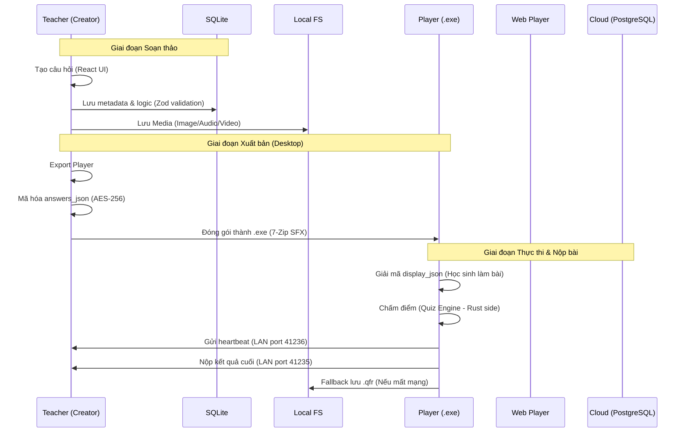
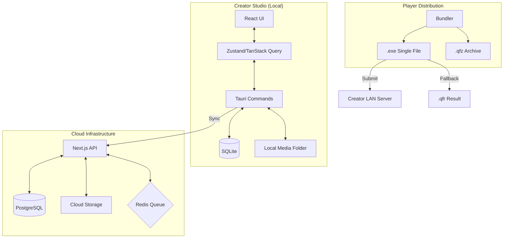

# QuizForge — Master Agents Knowledge Base (SotO)
> **Phiên bản**: 1.0.0
> **Mục tiêu**: Cung cấp toàn bộ bối cảnh kỹ thuật, logic nghiệp vụ và cấu trúc source code cho các AI Agent tiếp theo để có thể làm việc ngay lập tức mà không cần quét toàn bộ source.

---

## 1. Tổng quan Dự án (Project Overview)
QuizForge là bộ giải pháp thay thế hiện đại cho Wondershare QuizCreator (đã lỗi thời vì Flash). 
- **Triết lý**: Đơn giản cho giáo viên (Desktop-first), tin cậy cho phòng Lab (LAN-first), và quy mô cho Web (Cloud-sync).
- **Mô hình**: Monorepo quản lý cả ứng dụng Desktop (Creator/Player) và ứng dụng Web.

---

## 2. Kiến trúc Monorepo & Phân bổ Source Code
Dự án sử dụng **pnpm workspaces** và **Turborepo** để quản lý:

### Apps
- **`apps/creator`**: Ứng dụng Desktop dành cho giáo viên soạn thảo.
    - **UI**: React + Vite + TanStack Suite.
    - **Backend**: Rust (Tauri 2) quản lý SQLite, Local FS, và xuất Player. exe.
- **`apps/player`**: Shell minimal chạy bài thi cho học sinh. Khóa an ninh cao, hỗ trợ LAN.
- **`apps/web`**: Nền tảng Next.js (Cloud). Cho phép học sinh thi qua trình duyệt và đồng bộ dữ liệu với Creator.

### Packages (Shared)
- **`packages/types`**: Chứa toàn bộ Zod Schemas và TypeScript types (Nguồn sự thật duy nhất về dữ liệu).
- **`packages/ui`**: Component library dựa trên shadcn/ui.
- **`packages/quiz-engine`**: Logic chấm điểm, tính giờ, và xử lý trạng thái bài thi dùng chung cho cả Player và Web.

---

## 3. Cấu trúc Thư mục Chi tiết (Directory Structure)

### 3.1 Cấu trúc Tổng thể
```text
quizforge/
├── apps/                 # Các ứng dụng đầu cuối
├── packages/             # Các thư viện dùng chung (Internal packages)
├── docs/                 # Tài liệu hướng dẫn và đặc tả
├── scripts/              # Script hỗ trợ build/deploy
├── tools/                # Công cụ nội bộ (ví dụ: release tool)
├── package.json          # Root package definition (workspaces)
├── turbo.json            # Cấu hình Turborepo
└── pnpm-workspace.yaml   # Định nghĩa workspace cho pnpm
```

### 3.2 Ứng dụng Creator (`apps/creator`)
Đây là trung tâm soạn thảo (Desktop App).
```text
apps/creator/
├── src/                  # React Frontend
│   ├── components/       # Các UI Component đặc thù của Creator
│   ├── hooks/            # Custom hooks (chủ yếu gọi Tauri commands)
│   ├── routes/           # Định nghĩa các trang (TanStack Router)
│   ├── stores/           # Quản lý trạng thái (Zustand)
│   └── lib/              # Các utility, query client
├── src-tauri/            # Rust Backend
│   ├── src/
│   │   ├── commands/     # Bridge giữa JS và Rust (Logic xử lý chính)
│   │   ├── db/           # Thao tác với SQLite
│   │   ├── crypto/       # Logic mã hóa AES-256
│   │   ├── bundler/      # Pipeline xuất file .exe
│   │   └── main.rs       # Entry point của ứng dụng Desktop
│   └── tauri.conf.json   # Cấu hình an ninh, window, plugin của Tauri
```

### 3.3 Ứng dụng Web (`apps/web`)
Nền tảng Cloud (Next.js App Router).
```text
apps/web/
├── src/
│   ├── app/              # Next.js App Router (pages & APIs)
│   ├── components/       # UI Components cho web
│   ├── lib/              # Auth.js config, Prisma client
│   └── server/           # Logic backend-only (Actions, Services)
├── prisma/               # Schema định nghĩa cơ sở dữ liệu PostgreSQL
└── public/               # Assets tĩnh (logo, images)
```

### 3.4 Thư viện Shared (`packages/`)
Đảm bảo tính nhất quán giữa Local và Cloud.
```text
packages/
├── types/                # MUST READ: Schema Zod cho Quiz, Question, Result
├── ui/                   # Shared UI components (Radix + Tailwind)
└── quiz-engine/          # Core logic: Chấm điểm, Timer, Validation
```

---

## 4. Tech Stack Chi tiết
- **Frontend**: React 18, TypeScript, Tailwind CSS, shadcn/ui.
- **State/Data**: TanStack Query (Server state), Zustand (Client state), TanStack Router (Routing), TanStack Form (Validation).
- **Desktop Runtime**: Tauri 2 (Rust).
- **Database**: SQLite (Local - Creator), PostgreSQL (Cloud - Web via Prisma).
- **Real-time/Queue**: Redis (Web) để xử lý nộp bài thi quy mô 1000+ user.

---

## 4. Cấu trúc Dữ liệu & Định dạng File
### Chuẩn Dữ liệu Quiz (`packages/types/src/quiz.ts`)
Tất cả dữ liệu quiz tuân theo schema Zod chặt chẽ.
- **10 Loại câu hỏi**: `true_false`, `multiple_choice`, `multiple_response`, `fill_in_blank`, `matching`, `sequence`, `word_bank`, `click_map`, `short_essay`, `blank_page`.
- **Media**: Hình ảnh/Âm thanh/Video được quản lý qua UUID và lưu trữ trong thư mục `media` cục bộ hoặc Cloud Storage.

### Các định dạng file đặc thù:
- **`.qfz`**: File nén (ZIP) chứa `manifest.json`, `quiz.json`, `questions.json` và thư mục `media`. Dùng để import/export giữa các máy giáo viên.
- **`.qfr`**: Quiz Result file dùng để nộp bài thủ công khi mất mạng.

---

## 5. Các Logic Nghiệp vụ Cốt lõi (Core Business Logic)

### 5.1 Logic Chấm điểm (Scoring Engine)
Logic nằm trong `packages/quiz-engine`. 
- **Partial Scoring**: Hỗ trợ chấm điểm từng phần cho `multiple_response` và `sequence`.
- **Logic**: `points = max(0, (correct_chosen - wrong_chosen) / total_correct * max_points)`.
- **Click Map**: Kiểm tra tọa độ (rect/circle/polygon) xem có nằm trong vùng hotspot đúng hay không.

### 5.2 Quy trình Xuất Player (Export Pipeline)
Creator thực hiện các bước sau để tạo file Player .exe duy nhất:
1. Gói dữ liệu quiz thành `quiz.dat`.
2. **Mã hóa**: Dùng AES-256-GCM. Key được tạo từ PBKDF2 (quiz_id + timestamp).
3. **Bundling**: Dùng 7-Zip SFX để đóng gói `player.exe` + `quiz.dat` + `media/` + `WebView2 Bootstrapper`.

### 5.3 Bảo mật & Chống gian lận (Lockdown Mode)
- **Cơ chế**: Tauri gọi Windows API để Hook các phím hệ thống (Alt+Tab, Win Key).
- **Focus Detection**: Ghi lại số lần và thời điểm học sinh thoát tab (`tab_out_event`) và gửi heartbeat về máy giáo viên mỗi 10s.
- **Server-side Validation**: Trên Web, logic chấm điểm chạy ở Backend Next.js, frontend chỉ gửi ID phương án chọn.

### 5.4 Kết nối Mạng (Networking)
- **LAN Discovery**: Sử dụng mDNS (`mdns-sd` Rust crate) để Player tự tìm máy giáo viên trong mạng nội bộ.
- **Submission**: Thử nộp qua LAN (`port 41235`) -> Thất bại thì fallback lưu `.qfr` ra Desktop.

---

## 6. Quy tắc Phát triển (Execution Rules cho Agent)
1. **Quản lý Package**: Luôn dùng `pnpm`. Không dùng `npm` hay `yarn`.
2. **Type Safety**: Không dùng `any`. Luôn định nghĩa Zod schema trước khi thực thi logic dữ liệu.
3. **Tauri Commands**: Bọc toàn bộ lệnh Rust trong TanStack Query hooks.
4. **UI**: Tuân thủ Design System trong `MASTER_SPEC.md` (Geist font, màu Slate/Blue chuyên nghiệp, không màu mè AI Startup).
5. **Internationalization**: Ưu tiên tiếng Việt cho UI người dùng cuối (Giáo viên/Học sinh).

---

## 7. Luồng Hoạt động Chi tiết (Operational Workflows)

### 7.1 Lifecycle của một Quiz (Từ soạn thảo đến kết quả)


### 7.2 Logic Xử lý Media (Media Processing Engine)
- **Input**: Người dùng chọn file (PNG, JPG, MP4, MP3).
- **Process**: 
    1. Tauri nhận file path.
    2. Nếu là ảnh: Convert sang **WebP (85% quality)** để tối ưu dung lượng (giảm ~80% size).
    3. Lưu vào thư mục `media` theo cấu trúc `%QUIZ_ID%/%MEDIA_ID%.webp`.
    4. Cập nhật đường dẫn tương đối vào SQLite.
- **Output**: Media được nhúng vào file `.qfz` hoặc folder export của Player.

### 7.3 Logic Mã hóa & Bảo mật (Security & Encryption)
Đây là phần quan trọng nhất để chống gian lận:
1. **At Rest**: Toàn bộ đáp án đúng KHÔNG nằm trong JSON thuần túy của Player.
2. **Encryption Process**:
    - `Key = PBKDF2(quiz_id + secret_salt)`.
    - `Payload = Encrypt(answers_json, Key)`.
3. **At Runtime**:
    - Khi học sinh chọn phương án, JavaScript gửi `choice_id` sang Rust.
    - Rust thực hiện `Decrypt` đáp án đúng trong bộ nhớ và so sánh.
    - Rust chỉ trả về `{ is_correct: bool, feedback: string }`.
    - **Hệ quả**: Không thể tìm thấy đáp án trong DevTools (F12) hay LocalStorage.

### 7.4 Logic Đồng bộ hóa Cloud (Cloud Sync Strategy)
Dành cho phiên bản Web/Cloud:
- **Creator to Web**: 
    - Khi nhấn "Publish to Cloud", Creator gom toàn bộ SQLite data + Media.
    - POST lên Next.js API.
    - Chuyển cấu trúc từ `questions_json` sang PostgreSQL relational tables (Prisma).
    - Media được đẩy lên S3/Vercel Blob.
- **Web Result Processing**:
    - Học sinh làm bài trên Web.
    - Nộp bài -> Đẩy vào **Redis Queue** để tránh quá tải DB (Peak 1000+ user).
    - Worker xử lý queue -> Lưu kết quả vào PostgreSQL.
    - Creator kéo dữ liệu từ API về để hiển thị thống kê.

---

## 8. Sơ đồ Luồng Dữ liệu (Data Flow Diagram)



---

## 9. Quy tắc Phát triển (Execution Rules cho Agent)
1. **Quản lý Package**: Luôn dùng `pnpm`. Không dùng `npm` hay `yarn`.
2. **Type Safety**: Không dùng `any`. Luôn định nghĩa Zod schema trước khi thực thi logic dữ liệu.
3. **Tauri Commands**: Bọc toàn bộ lệnh Rust trong TanStack Query hooks.
4. **UI**: Tuân thủ Design System trong `MASTER_SPEC.md` (Geist font, màu Slate/Blue chuyên nghiệp, không màu mè AI Startup).
5. **Internationalization**: Ưu tiên tiếng Việt cho UI người dùng cuối (Giáo viên/Học sinh).

---
> **Lưu ý**: Thông tin chi tiết hơn về từng màn hình UI có thể tìm thấy trong `MASTER_SPEC.md`, nhưng logic thực thi kỹ thuật đã được tóm gọn hoàn toàn tại đây.
