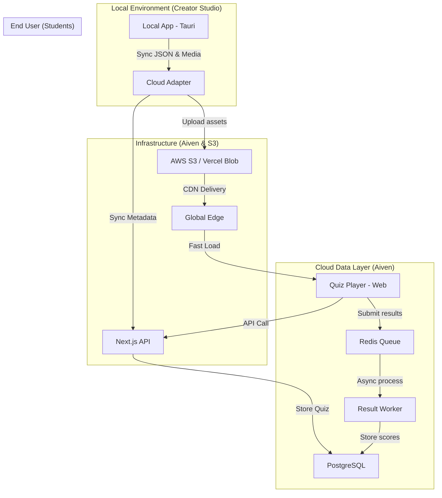

# Tài liệu Yêu cầu Hệ thống Chuyên sâu (Technical Requirements)

## 1. Kiến trúc Hệ thống (Architecture Diagram)

Hệ thống được thiết kế để tách biệt giữa việc **Soạn thảo (Write/Local)** và **Thực thi (Read/Web)**, sử dụng mô hình hạ tầng phân tán để đảm bảo hiệu năng 1000+ học sinh.

---

## 2. Thông số Kỹ thuật Mục tiêu (Performance SLA)

| Chỉ số | Mục tiêu (Target) | Giải pháp kỹ thuật |
| :--- | :--- | :--- |
| **Học sinh đồng thời** | **1,000+ người** | Redis Queue cho việc nộp bài & CDN cho việc tải bài. |
| **Thời gian nộp bài** | **< 100ms** | Chỉ ghi tạm vào Redis, không chờ PostgreSQL. |
| **Độ trễ tải Media** | **< 200ms** | Sử dụng Edge Caching (CDN). |
| **Độ chính xác điểm** | **100.00%** | Server-side validation (vô hiệu hóa chấm điểm tại trình duyệt). |

---

## 3. Schema Dữ liệu Chi tiết (Prisma / PostgreSQL)

Chúng ta sẽ chuyển từ cấu trúc "nhúng tất cả" (Embedded) của MongoDB sang cấu trúc quan hệ để tối ưu hóa việc truy vấn thống kê điểm của 1000 học sinh.

### Bảng Quiz (Bài tập)
*   **id**: `UUID` (Primary Key)
*   **creatorId**: `String` (Link tới bảng User)
*   **title**: `String`
*   **settings**: `JSONB` (Passing rate, time limit, randomization...)
*   **questions**: `JSONB` (Danh sách câu hỏi theo chuẩn @quizforge/types)
*   **isPublished**: `Boolean`
*   **stats**: `JSONB` (Lưu tổng hợp nhanh: trung bình điểm, số lượt làm)

### Bảng QuizResult (Kết quả)
*   **id**: `UUID`
*   **quizId**: `UUID` (Index)
*   **studentId**: `String` (Nếu có) hoặc `studentName`
*   **score**: `Float`
*   **timeSpent**: `Int` (seconds)
*   **answers**: `JSONB` (Đáp án học sinh đã chọn)
*   **status**: `Enum(PENDING, COMPLETED)`

---

## 4. Yêu cầu Bảo mật và Chống gian lận (Security)

*   **Scoring Engine**: Logic chấm điểm phải nằm hoàn toàn trong `@quizforge/quiz-engine`. Khi học sinh nhấn "Nộp bài", Web Player gửi mảng ID câu trả lời về API. Server sẽ gọi `quiz-engine` để so khớp với đáp án thật trong PostgreSQL. Học sinh **không thể** tìm thấy đáp án đúng trong `localStorage` hay `bundle JS`.
*   **CORS & Auth**: Chỉ chấp nhận yêu cầu đồng bộ từ ứng dụng Creator đã được xác thực qua JWT.
*   **Rate Limiting**: Giới hạn số lần nộp bài/IP để ngăn chặn tấn công giả lập học sinh.

---

## 6. Lựa chọn Triển khai (Deployment Options)

Để phục vụ **1000 học sinh cùng lúc**, chúng ta có hai hướng triển khai chính:

### Phân tích gói cước Vercel cho 1000 học sinh

Dựa trên yêu cầu **1000 học sinh truy cập cùng lúc**, việc lựa chọn gói cước là cực kỳ quan trọng:

| Tiêu chí | Gói Vercel Hobby (Free) | Gói Vercel Pro ($20/tháng) |
| :--- | :--- | :--- |
| **Giá thành** | Miễn phí | **$20/tháng** (mỗi người dùng) |
| **Giới hạn đồng thời** | Rất thấp (Dễ bị lỗi 503 Throttled) | **1000 executions / 10 giây** (Burst) |
| **Băng thông** | 100 GB | 1 TB (Thoải mái cho 1000 user) |
| **Thời gian chạy API** | 10 giây | Lên tới 300 giây |
| **Phù hợp** | Cá nhân, thử nghiệm | **Bắt buộc cho kỳ thi 1000 người** |

**Lưu ý quan trọng**:
*   Không có gói Pro $5/tháng chính thức từ Vercel. Có thể bạn đang nhầm lẫn với các dịch vụ bổ trợ hoặc ưu đãi học sinh/sinh viên.
*   **Tại sao phải dùng gói Pro?**: Khi 1000 học sinh cùng nhấn nút vào bài thi, gói Hobby sẽ ngay lập tức chặn các kết nối (Throttle) để bảo vệ hệ thống của họ, dẫn đến việc học sinh bị lỗi không vào được bài. Gói Pro cho phép xử lý "đột biến" (Burst) lên tới 1000 người cùng lúc, đảm bảo kỳ thi diễn ra trơn tru.

---

## 9. Ước tính Chi tiết Tổng chi phí (Estimated Monthly Cost)

Nếu bạn hướng tới phục vụ 1000 học sinh ổn định, đây là bảng dự toán:

1.  **Vercel Pro**: **$20** (Host Web & API).
2.  **Aiven PostgreSQL**: Khoảng **$7 - $15** (Tùy cấu hình Startup).
3.  **Aiven Redis**: Khoảng **$5 - $10**.
4.  **S3 Storage (AWS/Vercel)**: Khoảng **$2 - $5** (Tùy lượng ảnh/video).

**Tổng cộng**: Khoảng **$35 - $50/tháng** để có một hệ thống "nồi đồng cối đá" cân được 1000 học sinh thi cùng lúc một cách chuyên nghiệp.

---

## 7. Xác nhận Nền tảng Công nghệ

Toàn bộ hệ thống Web của QuizForge được xây dựng trên nền tảng **Next.js (App Router)**. Đây là lựa chọn tối ưu nhất hiện nay vì:
1.  **Full-stack**: Quản lý cả Frontend đẹp mắt và Backend API mạnh mẽ trong cùng một dự án.
2.  **SEO & Performance**: Tốc độ tải trang cực nhanh nhờ cơ chế Server Components.
3.  **Hệ sinh thái**: Dễ dàng tích hợp với Prisma (Database), Auth.js (Đăng nhập), và các thư viện UI hiện đại.

---

## 8. Kết luận về Hạ tầng cho 1000 User

Hệ thống sẽ hoạt động ổn định nhất khi kết hợp:
*   **Logic Web**: Chạy trên **Vercel** (với sức mạnh Serverless).
*   **Dữ liệu**: Chạy trên **Aiven** (PostgreSQL & Redis Managed).
*   **Tài nguyên**: Chạy trên **S3/Cloud**.

Cách kết hợp này giúp Server của bạn "vô hình" trước áp lực truy cập, vì tải trọng đã được chia nhỏ và gánh bởi các dịch vụ Cloud chuyên dụng.
